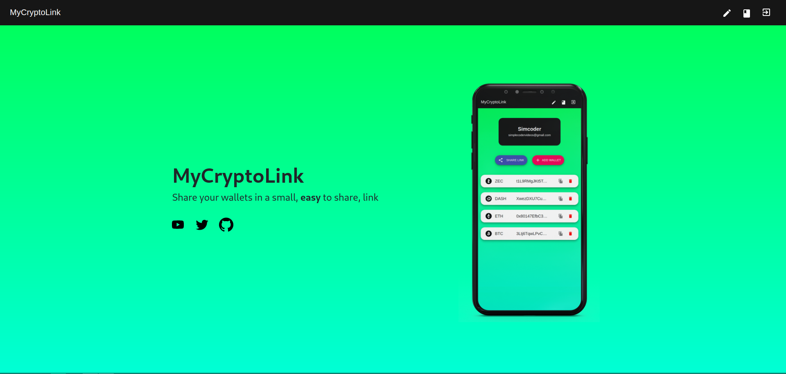

[](https://www.gnu.org/licenses/gpl-3.0)
[](https://twitter.com/simcoder_here)
[](https://www.instagram.com/simcoder_here/)
[](https://www.youtube.com/channel/UCQ5xY26cw5Noh6poIE-VBog)


<!-- PROJECT LOGO -->
<br />
<p align="center">
  <a href="https://github.com/SimCoderYoutube/MyCryptoLink">
    
  </a>

  <h3 align="center">MyCryptoLink</h3>

  <p align="center">
    A web application to share your wallets easily with just one link
    <br />
    <a href="https://github.com/SimCoderYoutube/MyCryptoLink"><strong>Explore the docs »</strong></a>
    <br />
    <br />
    <a href="https://www.mycryptolink.me">View Working website</a>
    ·
    <a href="https://github.com/SimCoderYoutube/MyCryptoLink/issues">Report Bug</a>
    ·
    <a href="https://github.com/SimCoderYoutube/MyCryptoLink/issues">Request Feature</a>
  </p>
</p>


<!-- TABLE OF CONTENTS -->
<details open="open">
  <summary><h2 style="display: inline-block">Table of Contents</h2></summary>
  <ol>
    <li>
      <a href="#about-the-project">About The Project</a>
      <ul>
        <li><a href="#built-with">Built With</a></li>
      </ul>
    </li>
    <li>
      <a href="#getting-started">Getting Started</a>
      <ul>
        <li><a href="#prerequisites">Prerequisites</a></li>
        <li><a href="#installation">Installation</a></li>
      </ul>
    </li>
    <li><a href="#roadmap">Roadmap</a></li>
    <li><a href="#contributing">Contributing</a></li>
    <li><a href="#support">Support</a></li>
    <li><a href="#license">License</a></li>
    <li><a href="#contact">Contact</a></li>
   
  </ol>
</details>


<!-- ABOUT THE PROJECT -->
## About The Project



This project is similar to linkTree and aims at allwoing anyone to easily share their crypto wallet adresses with anyone with just one easy link.

Specially important for anyone with an online presence that wants to receive donations as it offers a clean way of giving this donation option without the need to typing an adress each and every single time someone asks for it.


### Built With

* [ReactJs](https://reactjs.org/)
* [Firebase](https://firebase.google.com/)


<!-- GETTING STARTED -->
## Getting Started

To get a local copy up and running follow these simple steps.

### Prerequisites

This is an example of how to list things you need to use the software and how to install them.
* npm
  ```sh
  npm install npm@latest -g
  ```

### 💻 Installation

1. Clone the repo
   ```sh
   git clone https://github.com/SimCoderYoutube/MyCryptoLink.git
   ```
1. Install NPM packages
   ```sh
   npm install
   ```

1. Firebase
    1. Create a firebase project
    1. Start Realtime database (it won't get used but it needs to be initialized)
    1. Enable Firestore and paste the firestore_rules.txt into the rules tab
    1. go to authentication and enable google sign in
    1. go to project settings and add a web app
    1. Copy the firebaseConfig and past it into frontend/src/App.js replacing the current firebaseConfig
    1. Deploy the firebase function with the in backend/index.js file

1. Run
   ```sh
   npm start
   ```

<!-- ROADMAP -->
## Roadmap

See the [open issues](https://github.com/SimCoderYoutube/MyCryptoLink/issues) for a list of proposed features (and known issues).


<!-- CONTRIBUTING -->
## ➕ Contributing

Contributions are what make the open source community such an amazing place to be learn, inspire, and create. Any contributions you make are **greatly appreciated**. Please check the [Wiki](https://github.com/SimCoderYoutube/MyCryptoLink/wiki/How-to-Contribute) 


## 🌟 Show your support


Give a ⭐️ if this project helped you!


## 📝 License

Copyright © 2021 [SimCoder](https://github.com/simcoderYoutube).

This project is [GPL 3](https://github.com/SimCoderYoutube/MyCryptoLink/blob/main/LICENSE) licensed. Some of the dependencies are licensed differently.

<!-- CONTACT -->
## 👤 Contact


**SimCoder**

* Website: www.simcoder.com
* Twitter: [@simcoder\_here](https://twitter.com/simcoder\_here)
* Github: [@simcoderYoutube](https://github.com/simcoderYoutube)
* Youtube: [SimCoder](https://www.youtube.com/channel/UCQ5xY26cw5Noh6poIE-VBog)
